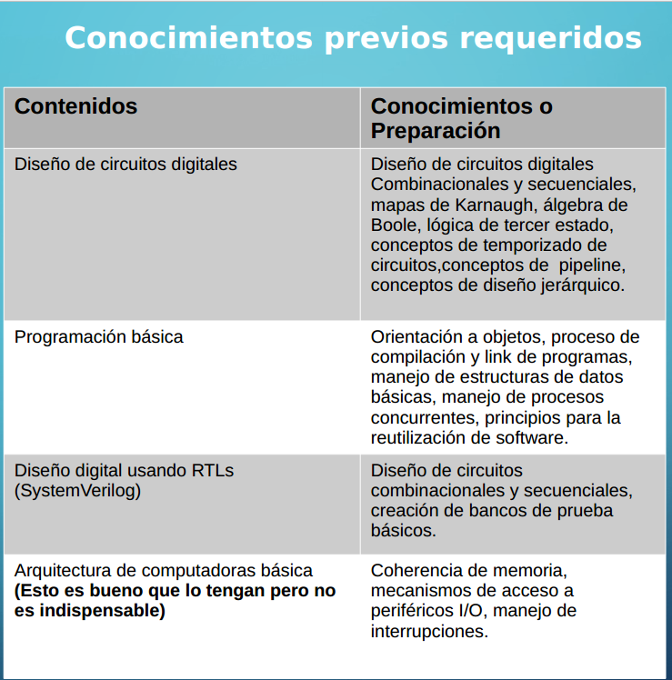

# Temas Importantes 
De que trata el curso

- Programación y diseño digital
- Usar system verilog de manera correcta, no solamente para diseño digital sino para hacer verificación
- Conocimientos previos:

Ver presentación

## Complicaciones de la verificación

Pensar el varios posibles escenarios donde el programa falle.
Especificaciones ambiguas

## Diseño de Verificación e Integración
Se puede hacer veriificación a distintos niveles del sistemas:
- NIvel de sistema
- Nivel de chip
- Nivel de unidad 
- Nivel de disñeador

## Proceso de diseño de un circuito Integrado 
**La verificación del curso se basa en:**
- Requerimientos del cliente
- Modelado algoritmico y simulación:
  Como el diseño de a arquitectura a nivel de algoritmo. 
  En esta área se ven el largo de pila, protocolos de coherencia de memoria.
- Modelado a nivel de sistema  
- Diseño y simulación en leanguaje HDL (Lo que mas se usa en la industria es verilog)
- Sintetizado y simulación del RTL
  A nivel de compuerta de biliotecas que implementan and, latches, or, mux
- Netlist nivel de compuertas Place & route
  Se escribe a nivel de compuertas
- GDSII
  Archivos gráficos que contiene los poligonos que van a tener las máscaras de 
  silicio que van a tener los circuitos intergrados
  
- Manufactura y Testing
  Empresas dedicadas a 
  kadem sinopsis y mentor graphics

## DIFERENTES ESTILOS DE VERIFICACIÓN

- Verificación o validación funcional:
  
En esto se enfoca el curso. Se toma la representación del modelo evaludado a nivel rtl o 
arquitetucra,... y se le da vectores de estimunlos y se ve los vectores de salida
Casos de esquina (VLSI), es imposible cubrir todos los casos de posible 
error. Casos mas posibles ddonde llegue a fallar el diseño 
En la verificación se verifica que el diseño cumpla con los requisitos. Que 
no este defectuoso.

- Verficación formal:
  
  Hace los mismo que la V. Funcional con la diferencia que se usan modelos 
matematicos. 

- Verificación TEST ("Testing")

Flujo Genérico de Verificación de diseño
1. Modelado de arquitectura
   - Especificaciones de arqiuitectura
2. Plan de verificación funcional
   - Identificar todos los casos de funcionaiento normal del sistema. Pruebas orientadas a que todos los casos de funcionamiento normal esten cubiertos.
   
   - Identificar todos los casos de esquina del sistema. Casos como en la ALU, Tales como desbordamiento, idvisiones por cero, multiplicaciones por numero muy grandes, donde no se usa acarreo y donde se usa acarreo. Son casos pocos comunes pero válidos.
   
   - Es una lista de features, una lista ded recursos que se van a necesitar para probar esos features, lista de dispositivos, interfaces, protocolos
   
3. Ambiente de verificación funcional 
   - Design under verification "DUV"
   - Hacer test
   - UVM
4. Analisis de corbertura
   - Se hace desde diferentes métricas que se van a ver luego. 
   - Análisis de maquinas de estado.
   
5. Cumple con lo esperado? 
   - si. FIN 
   - NO, VOLVER AL PUNTO 3

"Regla de 10x: cada de la etapas de encontrar el bug, mas barato es solucionar el problema

