# Problemas pag 161

MC:  Modelado por comportamiento
MNC: Modelado nivel de compuertas
MFD: Modelado de flujo de datos

## 4.1 Considere el circuito combinacional de la figura P4-1.

- a) Deduzca las expresiones booleanas para T1 a T4. Evalúe las salidas F1 y F2 en función de las
cuatro entradas.

- b) Escriba la tabla de verdad con 16 combinaciones binarias de las cuatro variables de entrada. Luego dé en la tabla los valores binarios de T1 a T4 y las salidas F1 y F2.

- c) Grafique en mapas las funciones booleanas de salida obtenidas en la parte b) y demuestre que las expresiones booleanas simplificadas son equivalentes a las obtenidas en la parte a).

## 4.2 Obtenga las expresiones booleanas simplificadas para las salidas F y G en términos de las variables de entrada del circuito de la figura P4-2.

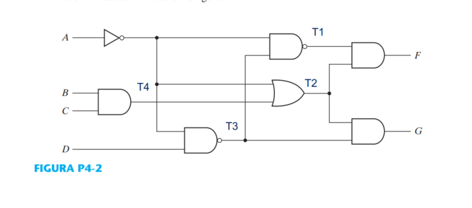

### Funciones del circuito:
- F = (A'D+A)(A'+BC)
- G = (A'+BC)(D´+A)

### Funciones simplificadas con propiedades del algebra booleana:
- F = A'D + BC + ABC
- G = A'D + BCD' +ABC

## 4.3 Para el circuito de la figura
- a) Escriba las funciones booleanas de las cuatro salidas en función de las variables de entrada.
- b) Si el circuito se presenta como tabla de verdad, ¿cuántas filas y columnas tendría la tabla?

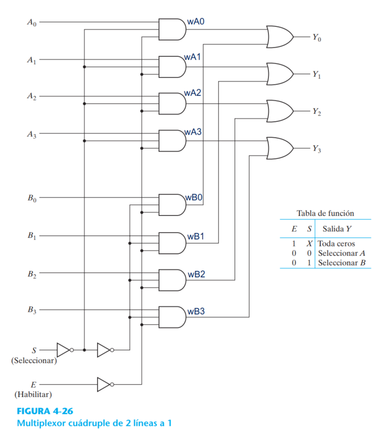

## 4.4 Diseño
Diseñar un circuito combinacional con tres entradas y una salida. La salida es 1 cuando el valor binario de las entradas es menos que 3, y es 0 en los demás casos.

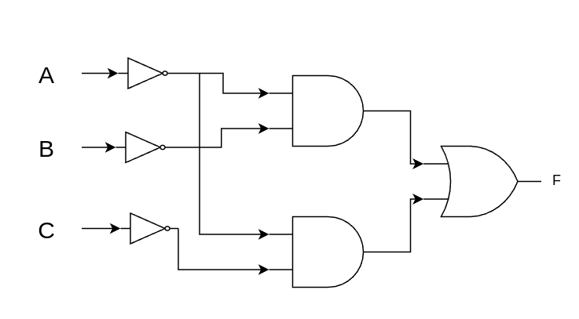

## 4.5 Diseño
Diseñe un circuito combinacional con tres entradas, x, y y z, y tres salidas, A, B y C. Cuando la entrada binaria es 0, 1, 2 o 3, la salida binaria es uno más que la entrada. Si la entrada binaria es 4, 5, 6 o 7, la salida binaria es uno menos que la entrada.

Circuito diseñado
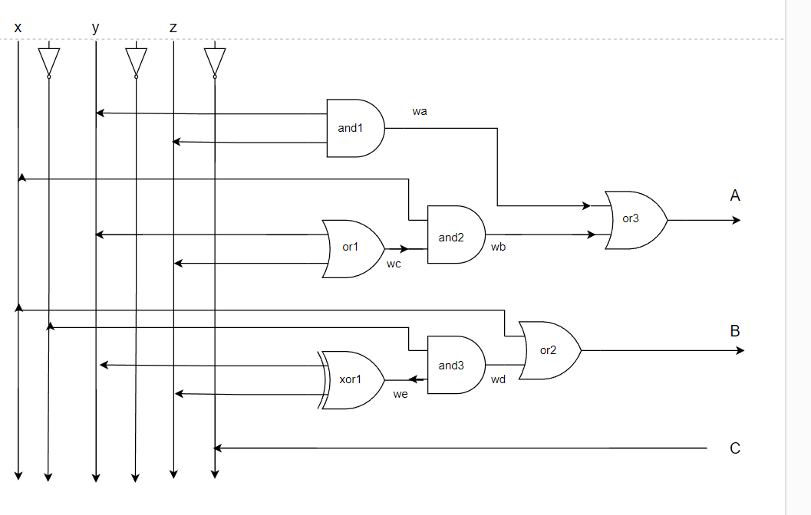

Circuito diseñado CORREGIDO
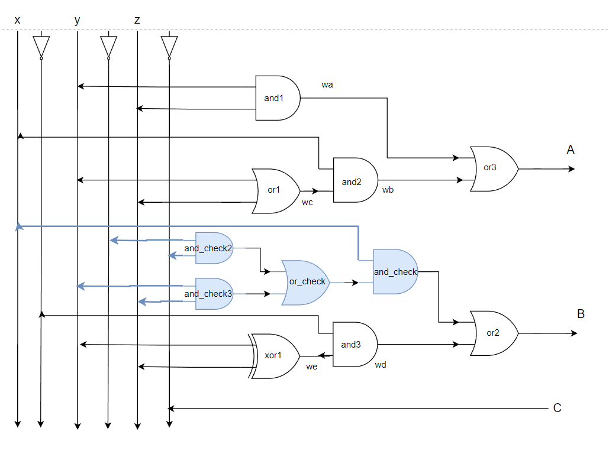

## 4.6 Diseño Circuito Mayoria 
Un circuito de mayoría es un circuito combinacional cuya salida es 1 si las variables de entrada
tienen más unos que ceros. La salida es 0 en caso contrario. Diseñe un circuito de mayoría de tres
entradas.

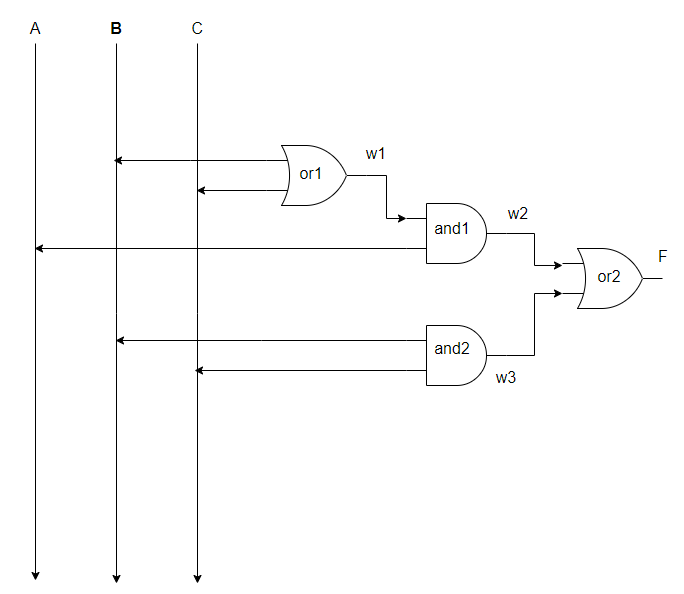

## 4.7 COnvertir código gray en código binario
Diseñe un circuito combinacional que convierta un código Gray de cuatro bits (tabla 1-6) en un número binario de cuatro bits. Implemente el circuito con compuertas OR exclusivo.

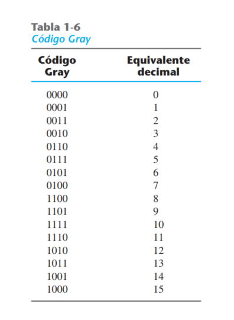

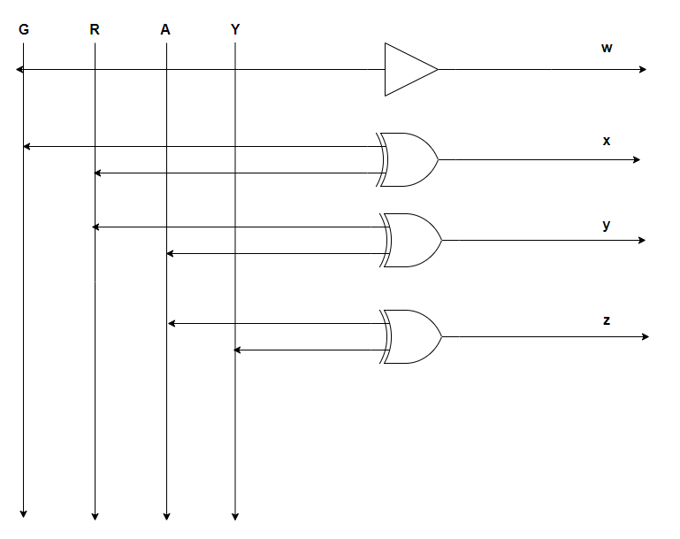

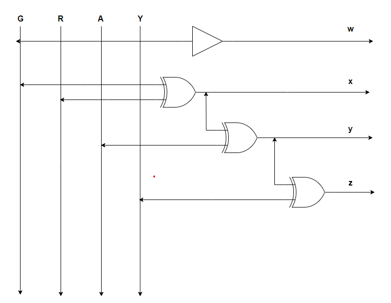

## 4.8 Diseño Conversor
Diseñe un convertidor de código que convierta un dígito decimal del código 8, 4, 22, 21 a BCD

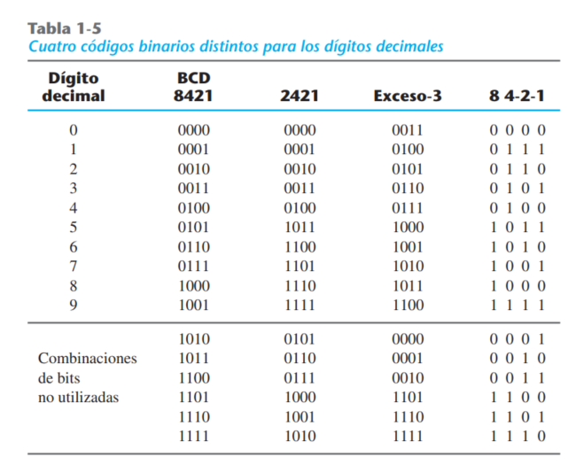

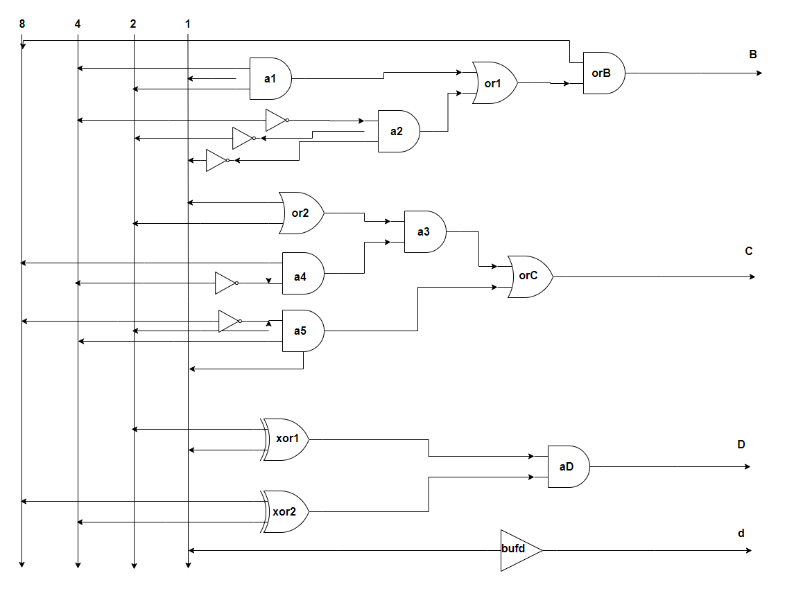

- Correción en la compuerta and 5

## 4.9 Diseño
Un decodificador de BCD a siete segmentos es un circuito combinacional que convierte un dígito decimal BCD en un código apropiado para seleccionar segmentos de un indicador que exhibe los dígitos decimales en la forma acostumbrada. Las siete salidas del decodificador (a, b, c, d, e, f, g) seleccionan los segmentos correspondientes del indicador, como se indica en la figura P4-9a). La forma de representar los dígitos decimales con el indicador se muestra en la figura P4-9b). Diseñe un decodificador de BCD a siete segmentos empleando el mínimo de compuertas. Las seis combinaciones no válidas deberán dejar el indicador en blanco.

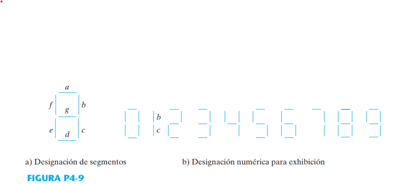
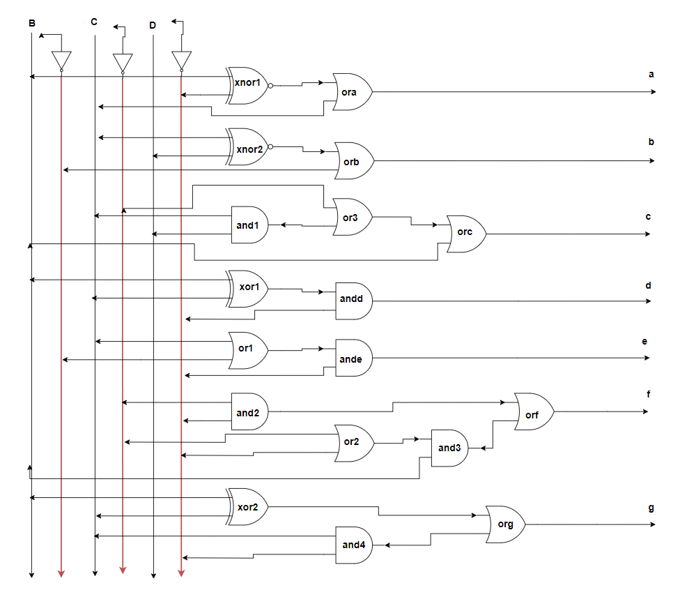

## 4.10 Complemento a 2
Diseñe un circuito combinacional complementador a dos, de cuatro bits. (La salida genera el complemento a dos del número binario de entrada.) Demuestre que es posible construir el circuito con compuertas OR exclusivo.

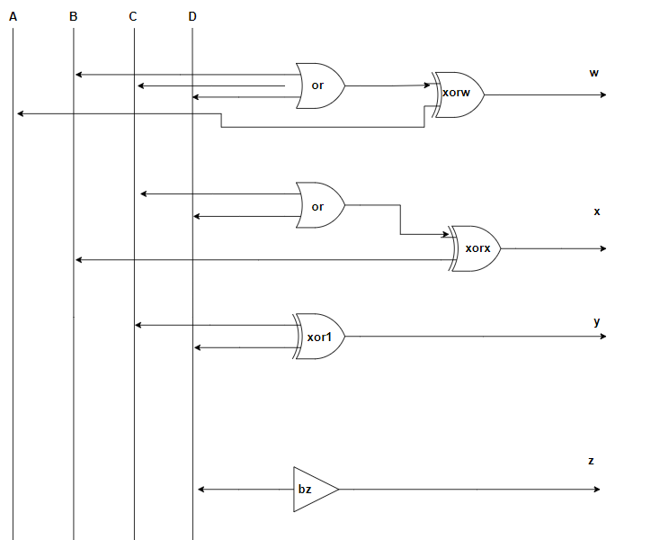

## 4-11 Incrementador de cuatro bits
Diseñar un circuito combinacional incrementador de cuatro bits. (Un circuito que suma 1 a un número binario de cuatro bits.) El circuito puede diseñarse con cuatro semisumadores.

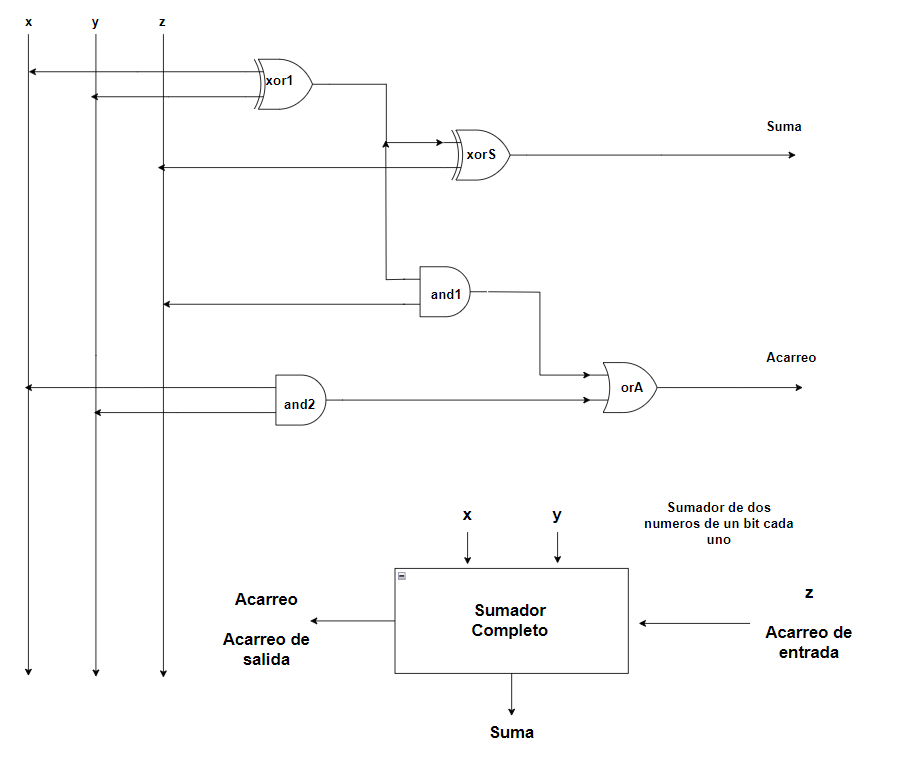

## 4-12 Circuito Restador
a) Diseñe un circuito semirrestador con entradas x y y, y salidas D y B. El circuito resta los bits
x-y, y coloca la diferencia en D y el préstamo (borrow) en B.
b) Diseñe un circuito restador completo con tres entradas, x, y y z, y dos salidas, D y B. El circuito resta x-y-z, donde z es el préstamo de entrada, B es el préstamo de salida y D es
la diferencia.