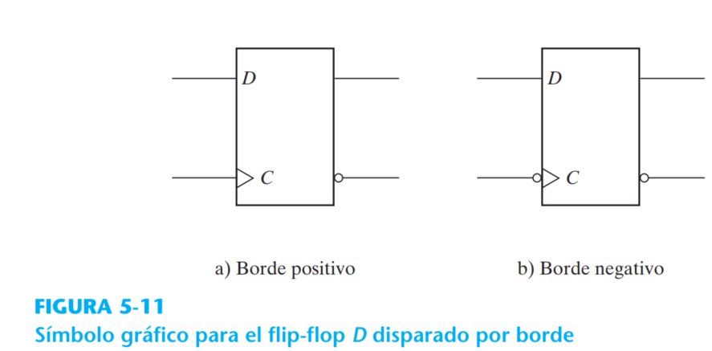
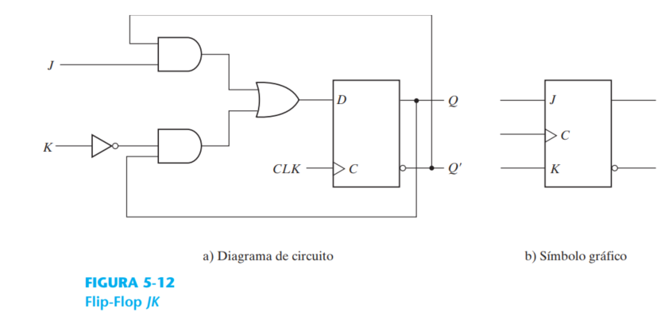
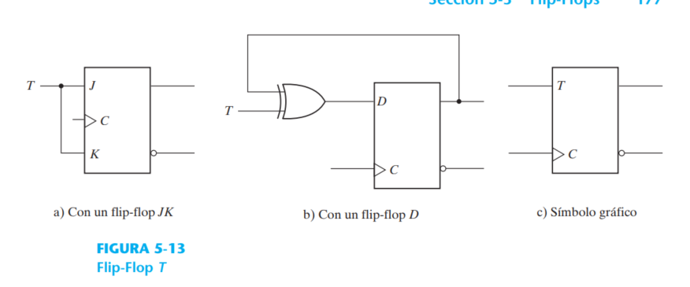
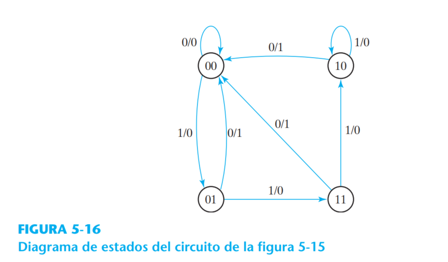
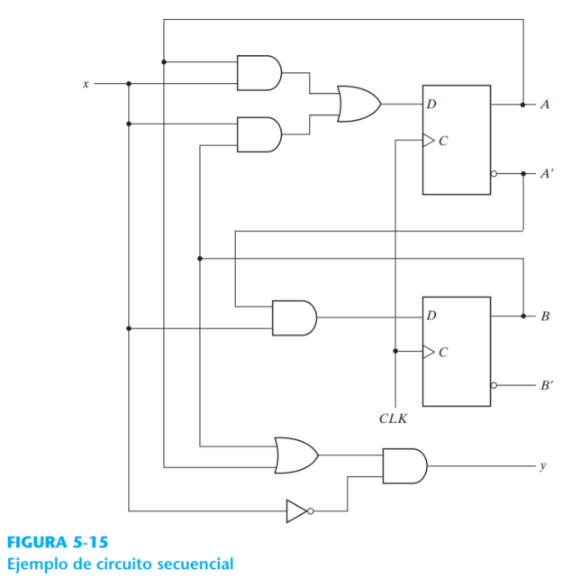
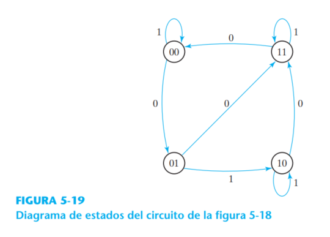
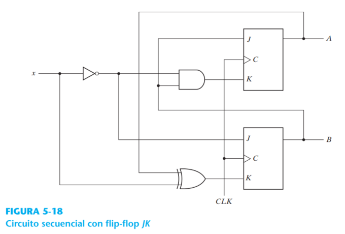
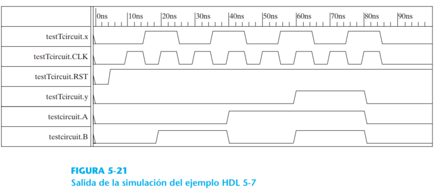

# Circuitos Secuenciales 

## Latches 
### Ejemplo 5.1: Latch D con entrada de control síncrona

### Latch JK

### Latch T

## Flip Flops

### Ejemplo 5.2 FFD (flanco positivo) y FFD con reset asíncrono

### Ejemplo 5.3 FFT-FFJK usando FFD y compuertas
- a) FFT usando FFD y compuertas

- b) FFJK usando FFD y compuertas

### Ejemplo 5.4 FFJK por modelado funcional

## Máquina de estados

### Ejemplo 5.5 Maquina de estados

- a) 

- b)

Resultado de la simulación

