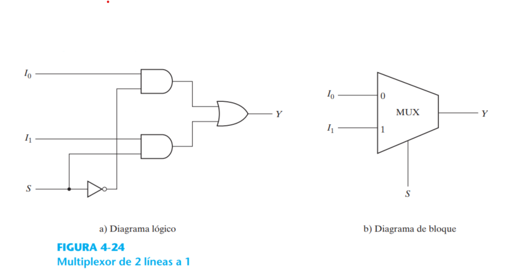
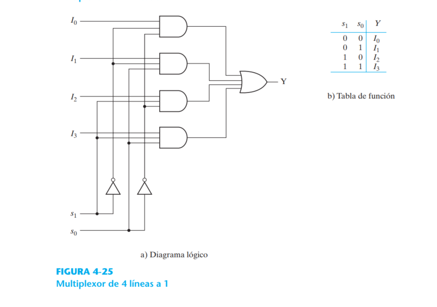

# Modelado por comportamiento
El modelado de comportamiento representa los circuitos digitales en un nivel funcional y algoríímico.

Se le utiliza primordialmente para **describir circuitos secuenciales**, pero sirve también para describir circuitos combinacionales.

-  Se emplea la palabra clave **always**
- La salida deben ser del tipo de datos **reg**
    La diferencia entre wire y reg es que este ultimo conserva su valor hasta que se le asigna otro.

## Circuito 4.7 Mutiplexor 2 a 1 (Diagrama de bloque)

~~~ verilog
module mux2x1 (A , B, select, OUT);
    input A, B, select;
    output OUT;
    reg OUT;
    always @ (select or A or B )
        if (select == 1) OUT = A;
        else OUT = B;
endmodule
~~~

El ejemplo muestra la descripción de comportamiento de un multiplexor de 2 líneas a 1.  Dado que la variable OUT  esuna salida deseada, se debe declarar como dato reg (ademas de la declaracion output) 

- Los enunciados de asignación procedimentales dentro del bloque always se ejecutan cada vez que hay un cambio en cualquiera de las variables indicadas después del símbolo @

- El enunciado if-else permite tomar una decisión con base en el valor de la entrada select.

- El enunciado if se puede escribir sin el simbolo de igualdad.
> if (select) OUT = A;
- Se examina select para ver si es un 1 lógico. 

## Circuito 4.8 Mux 4x1

~~~ verilog
module mux4x1(i0, i1, i2, i3, select, y);
    input i0, i1, i2, i3;
    input [1:0] select;
    output y;
    reg y;

    always @(i0 or i1 or i2 or i3 or select)
        case (select)
            2'b00: y = i0;
            2'b01: y = i1;
            2'b10: y = i2;
            2'b11: y = i3;
        endcase
endmodule
~~~
- La entrada select se declara como un vector de 2 bits.
- La salida y se declara como un dato reg
- El enunciado **always** tiene un bloque secuencial delimitado por la palabras clave **s** y **endcase**.
Este bloque se ejecuta cada vez que se cambia el valor de las entradas indicadas después del simbolo @.